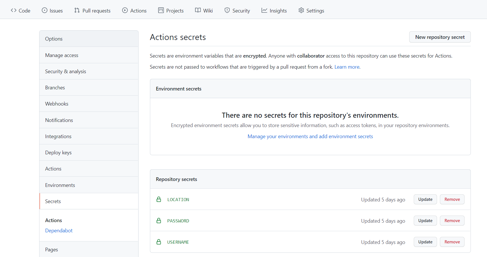
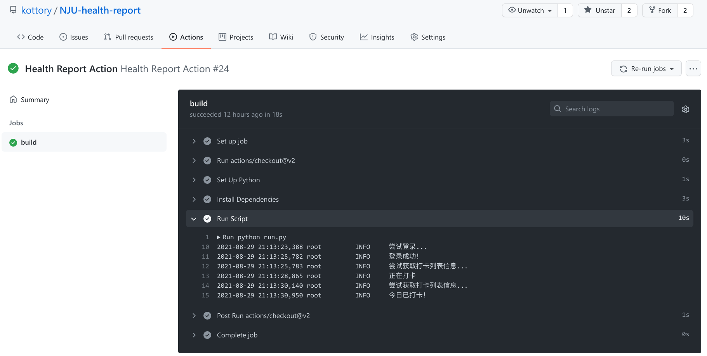

# NJU-health-report

南京大学每日健康填报自动打卡脚本。

## 说明
- 本项目仅供学习交流使用。开发者对项目造成产生的后果不负任何责任，也不保证本方案一直有效。请使用者对自己负责。
- 使用前须将项目 Fork 至自己的仓库，此时密钥只有自己才知道，可以保证信息的安全，请放心使用。 
- ~~因统一身份认证的特性，在输错一次密码之后会要求输入验证码。因此请在密码错误之后手动登录来去除验证码的限制。~~ 由于统一验证要求强制验证码，现在脚本会自动调用 OCR 库来识别验证码，并重复登录 3 次。
- 使用者必须对本项目自动化提交的信息负责，如果不信任或是有数据真实性的需求，请自行手动打卡。

## 更新
- 2022-4-17 更新了基于 ddddocr 库的验证码自动识别。
- 2022-4-10 更新了近日离宁和核酸时间的支持。 
- 2021-10-19 之前使用的方案实测已经无法正常使用，目前已回退旧方案。已 fork 的用户请更新后使用。

## 使用方法
1. 将本项目 Fork 到自己的仓库。
2. 打开自己 Fork 之后的仓库，因为没有填写账户信息，此时若触发打卡，一定会失败。
3. 进入 `Settings` 选项，点击 `Secret`，并选择 `New Repository Secret`。依次添加以下变量：
   - `username`: 学号
   - `password`: 南京大学统一认证的密码
   - `location`: 你希望打卡的地理位置。比如南京大学仙林校区可以填 `中国江苏省南京市栖霞区九乡河东路`

4. 回到 `Action` 选项卡，重新运行 Action，或者静待自动打卡。
5. 项目默认是在 13:00（UTC 时间）自动打卡，可以根据需要修改 `.github/workflows/report.yml` 中 `cron` 项。
6. 建议设置 GitHub Actions 通知为 `Send notifications for failed workflows only` 以接收构建失败的通知。这通常是默认设置项。

当 Action 启动之后，可以通过进入 Summary 来查看具体的记录。一次正常的打卡显示效果如下：

若构建失败，请遵循 Log 中的提示进行相应操作。

## 每次打卡做了什么
1. 设置【您的体温是否正常】为【正常】
2. 设置【您的其他健康情况】为【正常】
3. 设置【您今日苏康码显示颜色】为【绿色】
4. 设置【您的共同居住人今日苏康码显示颜色】为【绿色】
5. 设置【最近14天是否离宁】为【否】
6. 设置【您的最近一次核酸检测时间】为昨日。比如，若打卡时间是`2022-5-20 11:45:14`，则此项为【2022-05-19 11】
7. 设置【填报地址】为 `location` 项。 

## 待办
- [x] 自动识别验证码
- [ ] 增加更多的最近核酸检测时间方案
- [ ] 增加 `DISABLE` 项，以支持在保留项目的同时暂停自动打卡。